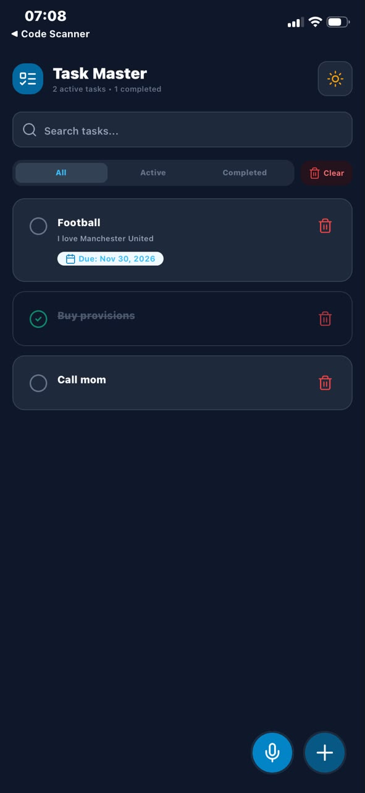
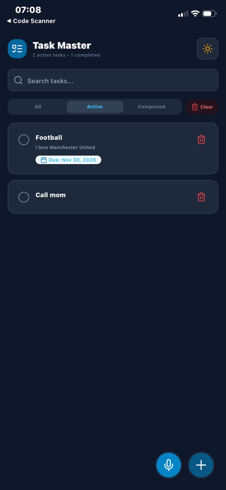
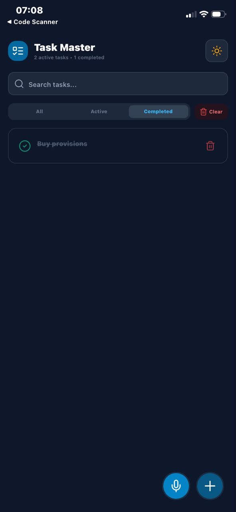
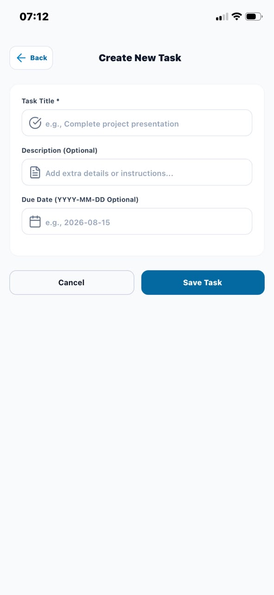
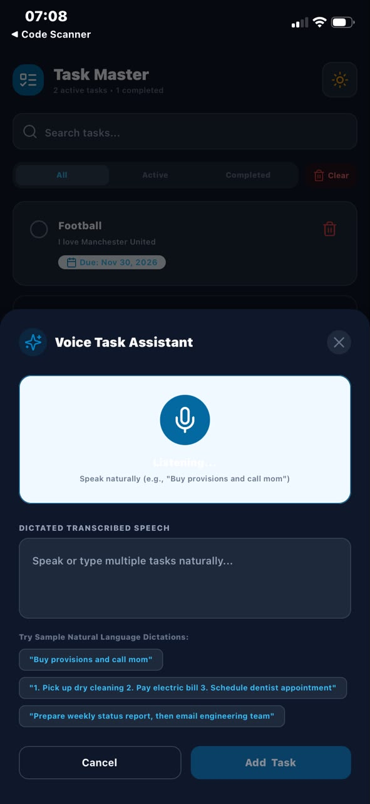
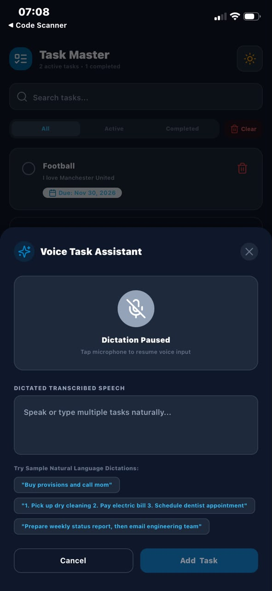
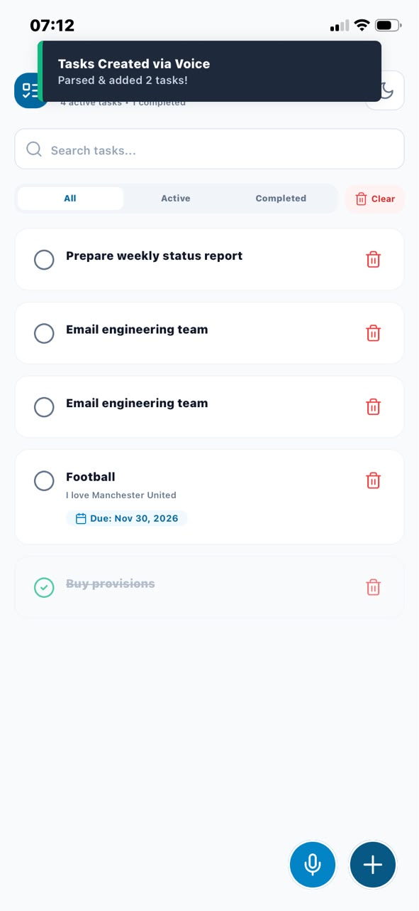

# 📱 Task Master - React Native (Expo SDK 54) To-Do List Application

A production-ready React Native (Expo SDK 54) To-Do List application built with TypeScript, Expo Router, NativeWind (Tailwind), Zustand state management, AsyncStorage local persistence, and an intelligent **Voice Input FAB** capable of parsing natural language speech dictations into multiple separate tasks.

---

## 🌟 Key Features

### 1. Task Management

- **Add Tasks**: Create tasks with titles, optional detailed descriptions, and due dates.
- **Completion Toggle**: Easily mark tasks as complete or incomplete with visual strike-through styling.
- **Delete Tasks**: Single-tap task deletion with haptic feedback.
- **Clear Completed**: Quick action button to remove all completed tasks at once.

### 2. Voice Input via FAB (Floating Action Button)

- **Voice Dictation Mode**: Dedicated Floating Action Button (FAB) that opens the Voice Assistant modal.
- **Intelligent Multi-Task Splitting**: Uses natural language processing rules to split multi-item dictated phrases into distinct task items automatically:
  - _Example_: Dictating `"Buy provisions and call mom"` automatically creates 2 tasks: `"Buy provisions"` and `"Call mom"`.
  - _Example_: Dictating `"1. Pick up dry cleaning 2. Pay electric bill 3. Schedule dentist"` creates 3 separate tasks.

### 3. Search, Filtering & Sorting (Bonus Features)

- **Live Search**: Instant keyword filtering across task titles and descriptions.
- **Status Tabs**: Filter view by **All**, **Active**, or **Completed** tasks.
- **Due Date Badges & Sorting**: Clear visual indicators for upcoming and overdue tasks.

### 4. Storage & State Architecture

- **AsyncStorage Persistence**: Tasks automatically persist across app launches.
- **Zustand State Store**: Reactive global state management.
- **Light / Dark Mode**: Theme toggle supporting custom dark mode styles.

### 5. Code Quality & Testing

- Strict TypeScript coverage (`tsc --noEmit`).
- ESLint + Prettier configured.
- Modular component architecture (`TaskItem`, `VoiceInputModal`, `Card`, `Button`, `Input`).
- Unit tests for task parser and storage utilities (`src/__tests__`).

---

## 📸 Screenshots

### Task List Screen — All Tasks (Dark Theme)

Shows a mix of active and completed tasks with search bar, filter tabs, due date badges, and FABs.



### Task List Screen — Active Filter (Dark Theme)

Filtering by "Active" tab to show only incomplete tasks.



### Task List Screen — Completed Filter (Dark Theme)

Filtering by "Completed" tab showing only finished tasks with strike-through styling.



### Add Task Screen (Light Theme)

Form with Title (required), Description (optional), and Due Date fields.



### Voice Input Mode — FAB Listening (Dark Theme)

Voice Task Assistant modal active with microphone listening, sample dictation chips, and transcribed speech input.



### Voice Input Mode — Dictation Paused (Dark Theme)

Voice Assistant with microphone paused, ready to resume dictation.



### Voice Tasks Created (Light Theme)

Toast notification confirming "Parsed & added 2 tasks!" after using the voice input FAB. Shows the newly created tasks in the list.



---

## 🛠️ Installation & Setup Instructions

### 1. Prerequisites

- Node.js (v18 or higher)
- npm or yarn
- Expo Go app on mobile device or iOS Simulator / Android Emulator

### 2. Clone & Install Dependencies

```bash
git clone https://github.com/davidojo1144/Aair-Labs.git
cd Aair-Labs
npm install
```

### 3. Start Development Server

```bash
npx expo start
```

- Press `i` to launch in iOS Simulator.
- Press `a` to launch in Android Emulator.
- Scan the printed QR code with **Expo Go** on a real device.

---

## 🧪 Running Unit Tests & Verification

```bash
# Run TypeScript type check
npm run type-check

# Run ESLint check
npm run lint

# Run Unit Tests
npm test
```

---

## 📁 Project Structure

```
├── app/
│   ├── _layout.tsx       # Root layout provider & navigation stack
│   ├── index.tsx         # Task List Screen (Search, Filters, Theme, Voice FAB)
│   ├── add-task.tsx      # Add Task Screen Form
│   └── +not-found.tsx    # 404 Route handler
├── src/
│   ├── components/
│   │   ├── TaskItem.tsx          # Task item card component
│   │   ├── VoiceInputModal.tsx   # Voice FAB speech modal & task splitter
│   │   ├── ui/                   # Reusable UI primitives (Button, Input, Card, Toast)
│   │   └── common/               # Common loading spinner & error boundary
│   ├── hooks/                    # Custom hooks (useAuth, useTheme)
│   ├── lib/
│   │   ├── taskParser.ts         # Natural language speech multi-task parser
│   │   ├── taskStorage.ts        # AsyncStorage persistence layer
│   │   └── utils.ts              # Class merger cn() helper
│   ├── store/
│   │   └── useTaskStore.ts       # Zustand global task store
│   ├── types/
│   │   └── task.ts               # TypeScript interfaces
│   └── __tests__/                # Unit tests
├── screenshots/                  # Required app screenshots
├── README.md                     # Application documentation
└── package.json
```

---

## 🏢 Contact & Organization Information

- **Organization**: Aair Labs / ETS Systems
- **Website**: [www.aairlabs.com](https://www.aairlabs.com)
- **Email**: apps.etssystems@gmail.com
- **Phone**: +234 813 965 9143
